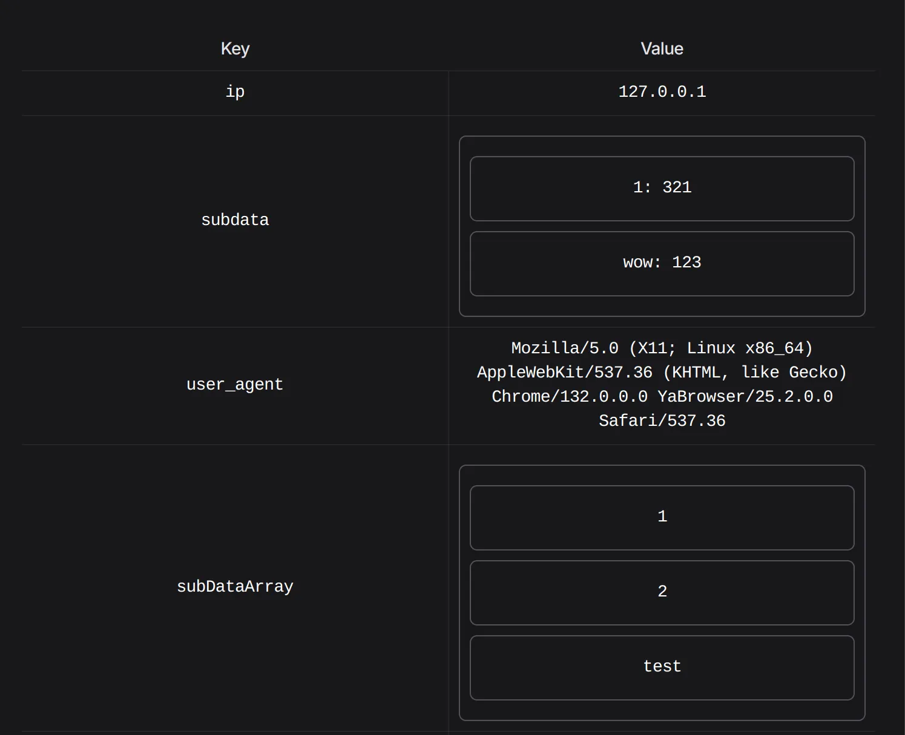
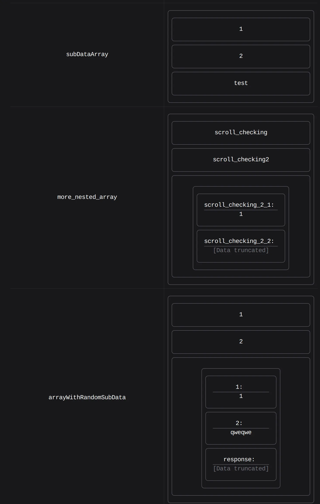

# Changelog

## 5.0.0 - 2026-03-16

### Filament v5 / Livewire v4 compatibility

- Bumped `filament/filament` to `^5.0` (Livewire v4 support)
- Bumped `pepperfm/ssd-for-laravel` to `^0.2`
- Updated CI matrix: added PHP 8.4, Laravel 12, dropped Laravel 10
- No breaking API changes — all existing `JsonColumn` configuration works as-is

## 2.0.0 - 22-03-2025

### Added feature to display nested data with maxDepth = 2

This json content
```json
{
  "ip": "127.0.0.1",
  "subdata": {
    "1": 321,
    "wow": "123"
  },
  "user_agent": "Mozilla/5.0 (X11; Linux x86_64) AppleWebKit/537.36...",
  "fingerprint": null,
  "subDataArray": [
    1,
    2,
    "test"
  ]
}
```
should look like:

---
This json content with this nesting level
```json
{
  "more_nested_array": [
    "scroll_checking",
    "scroll_checking2",
    {
      "scroll_checking_2_1": 1,
      "scroll_checking_2_2": {
        "data": {
          "some_bool_key": true
        }
      }
    }
  ],
  "arrayWithRandomSubData": [
    1,
    "2",
    {
      "1": 1,
      "2": "qweqwe",
      "response": {
        "data": {
          "some_bool_key": true
        }
      }
    }
  ]
}
```

should look like:


